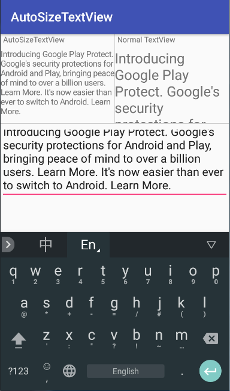

# AutoSizeTextView



### example

```xml
<me.temoa.autosizetextview.AutoSizeTextView
    android:id="@+id/auto_size_tv"
    android:layout_width="120dp"
    android:layout_height="wrap_content"
    app:atv_maxTextSize="22sp"
    app:atv_minTextSize="10sp" />
```
### xml attribute

xml attribute | description 
--- | ---
atv_maxTextSize | max text size
atv_minTextSize | min text size
